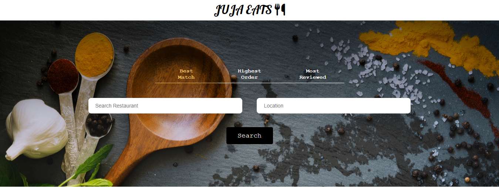

<h1 align = "center">JUJA EATS</h1>
<p>The Food business search app that utilizes the <a href="https://www.yelp.com/">(YELP API)</a>. It displays a list of available restaurants in the search locaiotn. Displays the ratings of the restaurants!</p>

</img>

<h3 align="center">Cloning and starting the App ...</h3>


<h3>1. Cloning into the repository</h3>

```bash
git clone {the url to the GitHub repo}
```
<h3>2. Open the App directory</h3>

```bash
cd Juja-Eats-REACT/tutorial
```

<h3>3. Install all required modules</h3>

```bash
npm install
```

<h3>4. Start the app</h3>

```bash
npm start
```
